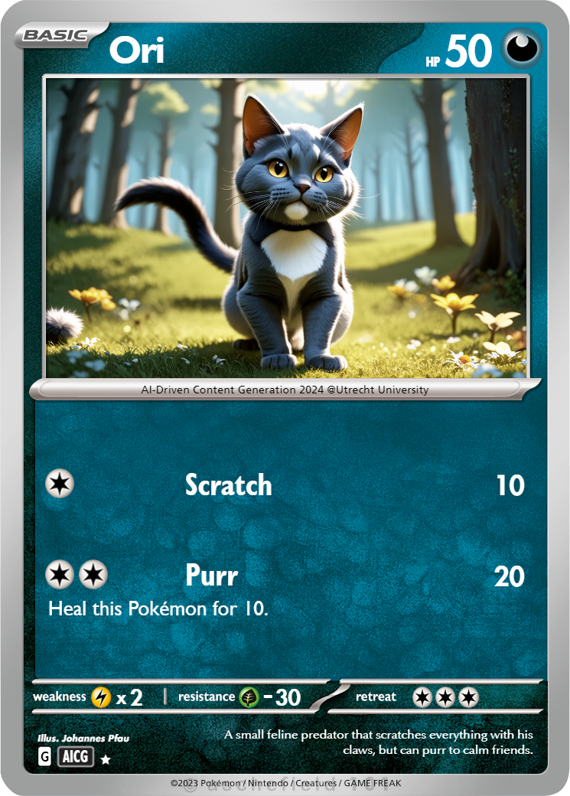
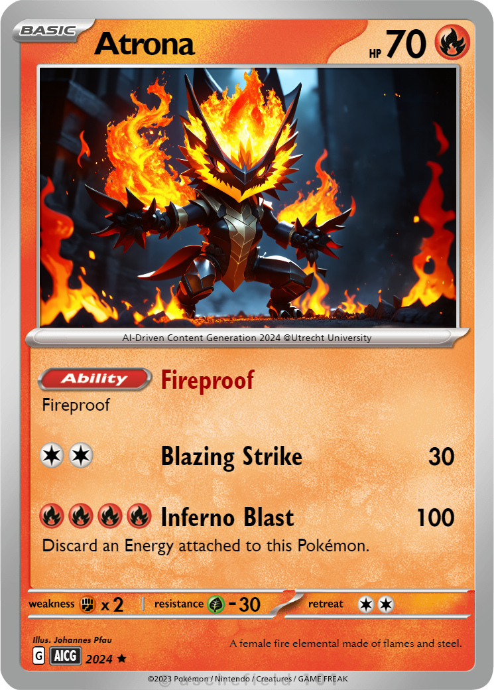

# generativePokemonTCG
This is a set of small scripts to mine data from ~1,000 unique Pokémon Trading Cards (courtesy of https://dev.pokemontcg.io/ ), and combine LLMs (GPT4All local server) and Diffusion Models (Comfy UI local server) to generate Pokémon cards given name, type and Pokédex entry. Final output format can be imported by https://pokecardmaker.net/creator to turn it into a card.

# Requirements
Local ComfyUI server running: https://github.com/comfyanonymous/ComfyUI

I used Stable Diffusion 3 Medium, but the image generation model is of course exchangeable: https://huggingface.co/stabilityai/stable-diffusion-3-medium

Local GPT4All server running: https://github.com/nomic-ai/gpt4all

I used Llama 3 8B Instruct, alternatives might yield different results: https://huggingface.co/meta-llama/Meta-Llama-3-8B-Instruct

# Usage
~~Download pokemonData json repository using the **pokemonDBtoJson.py**.~~
This repository contains pokemonData in the proper transformed .json format. In case you want to include some of the manually excluded card versions (etc.) or include newly released sets, you can use **pokemonDBtoJson.py** to align these.

Extract that folder and add it as a LocalDocs repository to GPT4All.

Let that finish the embeddings.

Start GPT4All as a local server.

Enable pokemonData in the Server Chat.

Modify the System Prompt of your desired model (e.g. SystemPrompt.txt).

**pokemonGenerate.py:**
Prompts GPT4All to complete an incomplete Pokémon card json (see example json 1). This will then be transformed into a format understandable for pokecardmaker (see example json 4).

**pokemonGenerateImage.py:**
Prompts ComfyUI to generate a Pokémon Card artwork according to the input (name, type, dex entry). Includes a couple of usually well-working tokens.

Outputs of both can be imported/uploaded to https://pokecardmaker.net/creator which results in a composed card image.

# Examples

# Limitations
Enough. This initial version serves as a demonstration for the course AI-Driven Content Generation (2024, Utrecht University). It does not verify whether generated abilities/moves are compatible with the trading card logic, and structural format checks of the LLM output are not exhaustive. The output of the pipeline can be double-checked step by step by inspecting the numbered .json files.
Even if the syntax is correct, there is no guarantee that the generated output makes any sense.

